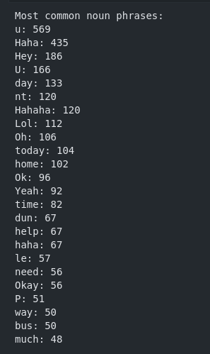

<h1> Analyzing Text Message Data - NLP ML Python Project</h1>
 
<h2>Features</h2>
<li>Import and look over clean_nus_sms.csv dataset</li>
<li>Conduct text preprocessing (Tokenization, Noise Removal, Text normalization)</li>
<li>Conduct analysis data</li>
<li>Conduct sentiment analysis on the text messages</li>
<li>Find the most common topics users text about</li>
<li>Determine how similar various users’ texts are (by topic, vocabulary use, or Levenshtein distance)</li>
<li>Create frequency distributions for messaging, sentiments, or key words/phrases</li>
<li>Use POS tagging to find commonly used phrases</li>
<li>Naive Bayes classification Model</li>
<h2>Acknowledgments</h2>

<b> Python3: http://bit.ly/python3-certifications <b>
 
<b> Machine Learning: https://bit.ly/machine-learning-certification <b>

<h2>Photo</h2>

 

<h2>Links</h2>
<li>Codecademy Project: https://www.codecademy.com/paths/natural-language-processing/tracks/nlp-portfolio-project/modules/nlp-skill-path-portfolio-project/kanban_projects/analyze-texts-with-nlp</li>
<h2>Contact</h2>

<b> Email: mariusc0023@gmail.com </b>
